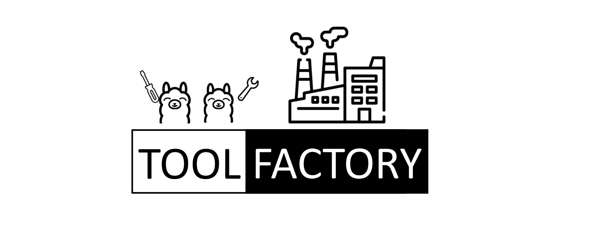
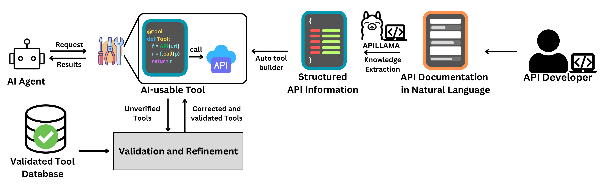

# 🏭 ToolFactory: Convert Any REST API Documentation into AI-Usable Tools 🏭

ToolFactory is your one-stop solution for turning messy, unstructured REST API documentation into polished, AI-compatible tools. Built for developers, by developers, it’s designed to take the hassle out of integrating APIs into LLM-based tool agents. Say goodbye to manually parsing through inconsistent docs and hello to a streamlined pipeline for building natural language-enabled tools.

## 🏭 What is ToolFactory? 🏭

APIs are the backbone of modern applications, but their documentation? Not so much. ToolFactory automates the transformation of REST API docs—no matter how unstructured—into tools ready to plug into AI workflows. It’s built to make your life easier and your tools smarter.

* 🛠 Automated Tool Generation
   Convert unstructured API docs into AI-ready tools in minutes. No sweat, no hassle.

* 🩺 Diagnosing
  Diagnose and squash errors in your generated tools with our evaluation method.

* 📚 Knowledge Base Magic
  Leverage a curated library of verified tools to fill gaps in poorly documented APIs. 

## 🛠 How It Works

1.    **Feed the Machine**: Supply your unstructured REST API docs.
2.    **Let ToolFactory Do Its Thing**: Watch as it parses, diagnoses, and transforms APIs into tools.
3.    **Integrate and Dominate**: Plug the tools into your LLM-based agents and level up your AI workflows.

Contributions welcome. Issues encouraged. Stars appreciated. ⭐ Let's make API integration awesome together.

# Get Started
## Setup environment
Open `.env` and enter your `OPENAI_API_KEY`.
## Prepare Your Documents
Create a new folder under `extractor\apidocs\` and rename it as your API name, for example, `extractor\apidocs\exampleapi`. Use the "save page as" button in your browser to download the web html.
## Generate Tools
```shell
python extractor\api_code_generator.py extractor\apidocs
```
Occasionally, the generated tools will have no base url(not specified in the raw documentation).
In this case, you can manually add a `.config` file in the API folder with
```JSON
{
    "base_url": "https://your_base_url_here"
}
```
Then, you overwrite the tools
```shell
python extractor\api_code_generator.py extractor\apidocs -o
```
## Validation
Check `main\tool_testing.ipynb` for more details.

## Export
Export your tools into `openapi` specification.


# For research
API Extraction Benchmark available on huggingface `[masked]\APIdoc2json`
Our prompt tuned APILLAMA can be accessed at `[masked]\APILlama`
Our training and evaluation code under `APILlama` folder